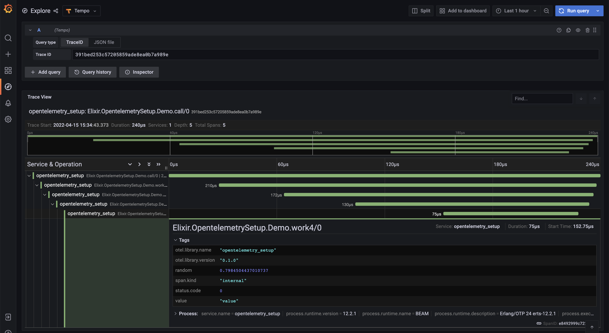

# Setup Tempo and Elixir to have tracing locally

Based on the presentation from https://github.com/kamilkowalski/opentelemetry-demo

This is a simple example on how to setup a tracing environment on your Elixir project to help you during development.

## What do you need in Elixir?

Add a new application for the SSL certificate checks and add de dependencies in your `mix.exs`

```elixir
#...
def application do
    [
      extra_applications: [
        # ...
        :tls_certificate_check
      ]
    ]
end
#...
defp deps do
    [
        {:opentelemetry_api, "~> 1.0"},
        {:opentelemetry, "~> 1.0"},
        {:opentelemetry_exporter, "~> 1.0"},
        {:tls_certificate_check, "~> 1.13"},
    #...
    ]
end
```
On your `config.exs` configuration

```elixir
config :opentelemetry, :resource, service: %{name:"app_name"}

config :opentelemetry,
       :processors,
       otel_batch_processor: %{
         exporter: {:opentelemetry_exporter, %{endpoints: [{:http, 'localhost', 55681, []}]}}
       }
```

And then instrument the areas of the code you want to measure. I suggest that the span has the Module name, the function and the arity.
```elixir
    require OpenTelemetry.Tracer, as: Tracer

    Tracer.with_span "#{__MODULE__}.function/arity" do
    end
```

You can add more metadata to each trace to the active trace using `OpenTelemetry.Tracer.set_attribute/2` or `OpenTelemetry.Tracer.set_attributes/1`, check https://hexdocs.pm/opentelemetry_api/OpenTelemetry.Tracer.html for more information.

## Setup Grafana and Tempo
Finally, `docker compose up -d` and access http://localhost:5000 .

You also need to check tempo container logs to get the trace ids received by tempo with `docker logs -f <tempo container name or id>`

## Demonstration
In this demo app, try it out by running `iex -S mix` and call `OpentelemetrySetup.Demo.call()`.

In the code you can see that we instrument multiple functions and that we add an attribute to the last span to see what args were received by the function.


